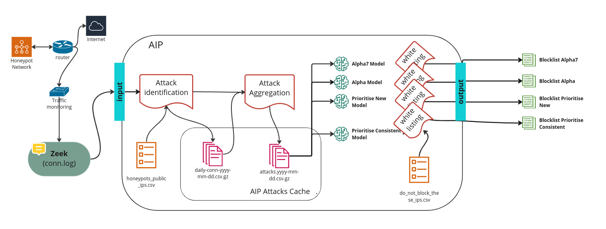

# Attacker IP Prioritization (AIP) Tool
The Attacker IP Prioritization (AIP) is a tool to generate IP blocklists based on network traffic captured from honeypot networks. Originally designed to create the blocklists for the [Stratosphere Blocklist Generation project](https://mcfp.felk.cvut.cz/publicDatasets/CTU-AIPP-BlackList/), it aims to generate an IoT-friendly blocklist. With the advent of 5G, IoT devices will be directly connected to the Internet instead of being protected by a router's firewall. Therefore we need blocklists that are small and portable and designed to block those IPs that are targeting IoT devices. The main models used to this end are the Prioritize Consistent and the Prioritize New.

Eventually, the project evolved, aiming to test new blocklists generation models beyond the PN and PC. The actual codebase allows a fast developing and testing of those new models, providing a common interface to access the attacks from several sensors deployed on the Public Internet, and a common set of metrics to compare the output of the models.

Given a honeypot network in your organization, it should be easy to use AIP to generate your own local blocklists based on the traffic reaching the honeypots.

## Using the framework

## Creating new models

## Data from the TOM
